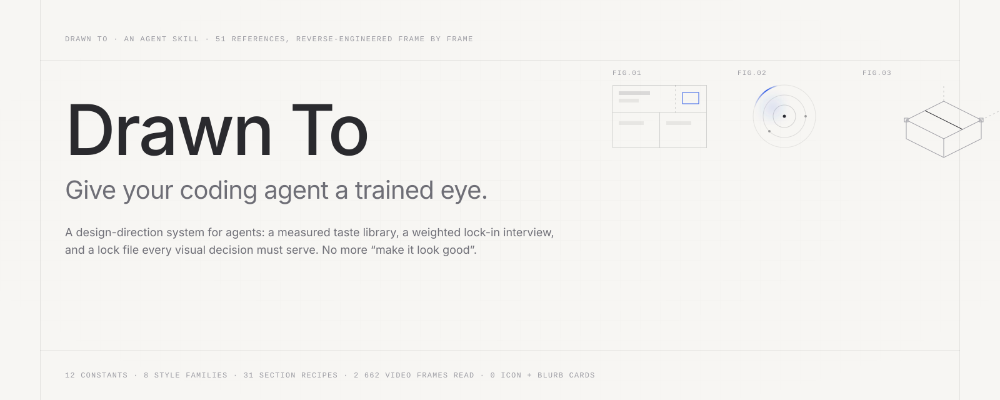
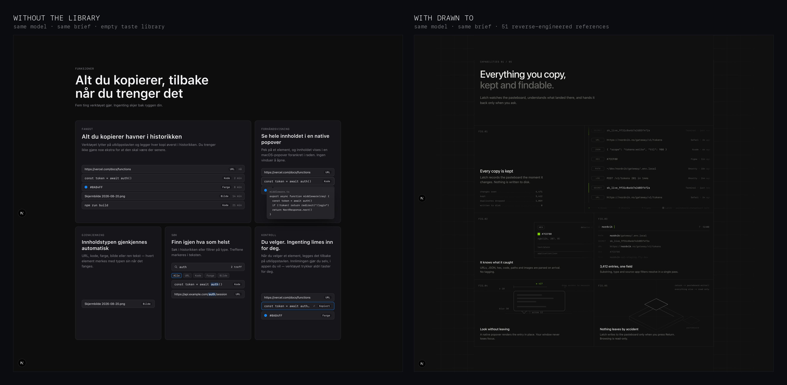
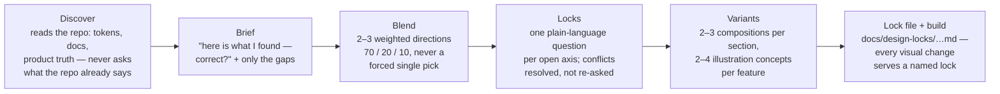
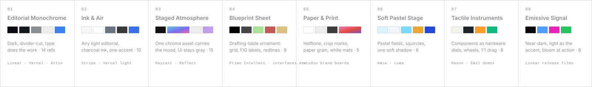
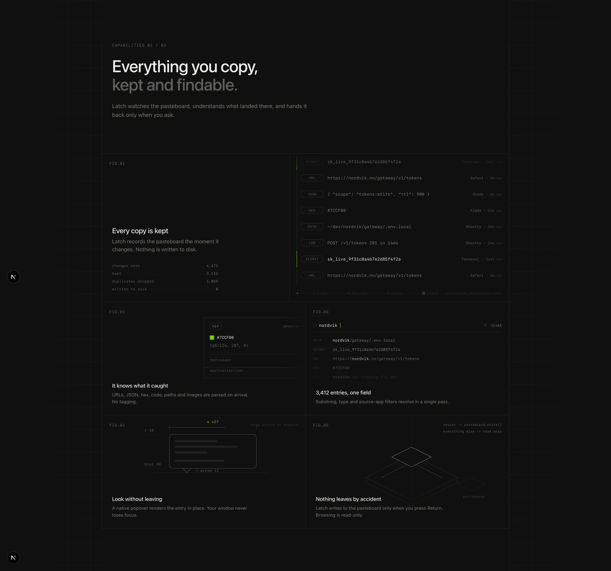

<picture>
  <source media="(prefers-color-scheme: dark)" srcset="assets/hero-dark.svg">
  
</picture>

<p align="center">
  <a href="https://skills.sh"></a>
  
  
  
</p>

**Drawn To** is an agent skill that replaces "make it look good" with a locked design direction.
It carries a *measured* taste library — 51 saved references reverse-engineered frame by frame
into 12 constants and 8 style families — runs a short, plain-language interview where you
answer with **weights** instead of forced single choices, and writes a lock file every visual
decision must serve. Then it builds.

> Stop describing taste to your agent. Hand it the eye.

<br>

## Same model. Same brief. One variable.



Two agents, the same model, the same five-feature brief, the same empty folder. The left one had a well-engineered skill with an *empty* knowledge layer — abstract "recipes", zero hex, zero px, zero ms. The right one had this library. Everything you see on the right is traceable to a reference: the divider-cut grid to `basit_designs-2017`, the FIG plates to `0xSero-2090`, the scrubbable redline popover to `cabralorenzo-2090`. The difference is not the model. It is the library.

<br>

## Install

```bash
npx skills add Stianlars1/drawn-to
```

Works in Claude Code, Codex CLI, Cursor, GitHub Copilot, Gemini CLI and every host that reads `SKILL.md`.
Manual: copy `skills/drawn-to/` into your project's skills directory (`.claude/skills/`, `.agents/skills/`, …).
ChatGPT: paste `SKILL.md` + `references/style-families.md` as project instructions.

Then just ask for UI — *"new hero for the landing page"*, *"a features bento with these five capabilities"* — or invoke `/drawn-to`.

<br>

## What happens when you invoke it



A question looks like this — no jargon, weights allowed, anchors you know:

> **3 of ~8 — How should surfaces separate?**
> **A.** Thin light dividers cut from one dark surface — structure felt, not seen *(like Linear)*
> **B.** One soft, wide shadow and no borders — warm, friendly *(like Amie)*
> **C.** Tone steps and air only — no lines, no shadows *(like Stripe light)*
> Answer with weights if you like several: "70% A + 30% C — A for the cards, C for the hero."

And the output is a contract, not a mood board:

```markdown
| #  | Axis        | Locked                                   | Firmness  | Consequence                              |
|----|-------------|------------------------------------------|-----------|------------------------------------------|
| Q1 | Blend       | 65% Editorial Monochrome + 15% Blueprint | must-have | F1 owns ground/separation/radius …       |
| Q2 | Separation  | 1px alpha dividers, no fills             | must-have | zero shadows on dark (16/16 refs)        |
| Q3 | Radius      | sharp 0 — radius only on buttons         | must-have | shared-edge grid; 3 tiers 0 / 0 / 6–8    |
| QI4| popover     | redline plate, pointer-scrubbable 1:1    | must-have | value chips track the pointer, no tween  |
```

Revisions never erase a row — a changed lock becomes `revised (reason)` and the replacement is added. The ledger is history.

<br>

## What's inside

```
skills/drawn-to/
  SKILL.md                     the contract: 6-step process, 12 constants, output checklist
  references/
    discovery.md               repo recon + a trust model: product facts / infrastructure tokens / design state
    style-families.md          the master: 12 constants (count-backed), 8 families, blend rules, clashes
    question-flow.md           the interview protocol, plain-language glossary, axis bank, lock-file template
    recipes.md                 31 named composition variants across 9 section kinds
    illustration-ideation.md   per-feature illustration engine: verb → metaphor register → hero + evidence, 20 devices
    scroll-scrub.md            scroll-scrubbed product scenes (registered-property poses, three drivers, mobile playbook)
    animation-craft.md         build doctrine: the animate-at-all gate, curves, springs & gesture physics, never-ship list
    animation-recipes.md       14 ready-to-build component animations
    isometric-and-light.md     two paths: isometric objects (construction math) and structured light (why shaped gradients read expensive)
    production-formula.md      page-scale values measured live off 7 famous sites
    layout-language.md · motion-grammar.md · graphic-language.md · color-type.md
    matrix.md                  index of every reference
    posts/                     51 frame-level analyses, one per reference
scripts/validate-library.py    citation, frontmatter, matrix and read-order integrity — runs in CI
```

<br>

## The library

Every claim carries a reference slug and a number. The constants are the things that held across the whole corpus — the skill enforces them and never asks about them:

| | Constant | Evidence |
|--|--|--|
| C1 | Quarantine chroma — neutral shell, at most **one** accent hue in the UI layer | 45/45 quarantine · 38/45 hold to ≤1 accent |
| C2 | Show the feature — working fragments, mechanisms, frozen interactions; **never icon + paragraph** | 33/45 · 0 counter-examples |
| C3 | Separation ladder — hairlines, tone steps, or one soft shadow; **zero drop shadows on dark** | 45/45 · 16/16 dark refs |
| C4 | Hierarchy by size and gray value at weight 400–600 — bold is the last resort | 35/45 |
| C5 | Two voices — grotesque prose + a mono data voice; numerals always tabular | 22/45 explicit |
| C6 | Two motion registers, never mixed — ambient linear, interaction 150–800 ms eased | 27/27 motion refs |
| C7 | Loops close frame-perfectly; concurrent loops desync (2.45 / 2.5 / 5 / 7.4 s) | 17/27 |
| C8 | Radii in stepped 3-tier families, nested concentrically (outer = inner + padding) | ~20 explicit · 0 counter |
| C9 | Texture every large gradient — 2–6 % grain or a print/pixel process | 11/13 gradient refs |
| C10 | Diegetic microcopy — zero lorem, versioned filenames, arithmetic that reconciles | 45/45 |
| C11 | Opacity is the attention system — one full-contrast focal, siblings 15–45 % | 12/45 |
| C12 | Ambient background ⇒ page composed at t = 0; entrances only as word-group blur reveals | — |

The families are what you blend. Each has measured grounds, separation physics, radius family, texture, graphic device, motion register, and a "choose when":



Proven pairings (F1+F4, F2+F3, F1+F3, F6+F2…) and documented clashes (pastel × blueprint, print × glow) are part of the library — the interview warns before you mix what never co-occurs, and offers the resolution.

<br>

## Beyond direction

The interview locks *what*. Four companion references make the agent build it *well*:

- **Illustration ideation** — for every feature, 2–4 concepts across metaphor registers (instrument · mechanism · product-fragment · blueprint plate · isometric object · light), each with a construction recipe. The feature's *verb* picks the metaphor; an evidence chip carries the proof.
- **Scroll-scrub** — the pinned product-scene pattern: poses as registered custom properties, one keyframe track, scroll / keyboard / static drivers, `svh` mobile math, a fallback ladder where every rung is composed.
- **Animation craft + recipes** — implementation doctrine distilled from [Emil Kowalski's skills](https://github.com/emilkowalski/skills) and Apple's fluid-interface physics: the animate-at-all gate, the curve trio, springs with velocity handoff, interruptibility, clip-path tricks, a never-ship list; plus 14 paste-ready component recipes.
- **Isometric & light** — how blueprint isometrics and soft-shaded iso scenes are constructed (2:1 matrices, hatch, stipple, conveyor motion), and why shaped light reads expensive where radial blobs read cheap — with CSS/SVG recipes for arcs, slabs, rays, rings, dot-maps and ribbons.

<br>

## Case: a features bento, greenfield, 40 minutes



Brief: *five features for a macOS clipboard tool, dark, no tokens yet.* Discovery found the owner's own scaffold generator, adopted its palette, asked only about the look. Locked blend 65 / 15 / 12 / 8 — Editorial Monochrome · Blueprint · Tactile · Emissive. Fifteen locks, 27 animations measured frame-perfect, a pointer-scrubbable redline popover as the tactile cell, and a ledger with four revision rows. Everything in the frame answers to a row in `docs/design-locks/`.

<br>

## Bring your own eye

This ships one person's taste, measured. The pipeline is the reusable part:

1. **Fetch** a reference (X post, site capture, video) into `references/media/` — never committed; the originals stay the authors'.
2. **Analyze** frame by frame with the per-post template (layout · card anatomy · type & color · graphic language · motion timeline · why saved · extractable rules). Values, not adjectives.
3. **Synthesize** — families, constants, devices — and cite slugs everywhere.
4. **Validate** — `python3 scripts/validate-library.py` checks every citation resolves, every post has frontmatter, the matrix is consistent. CI runs it on every push.

Replace the corpus with yours and the interview asks about *your* families.

<br>

## Credits

The library stands on the work of the designers it studies — every entry links to the original:
@0xSero · @AlexandruDranga · @GrahamPaterson · @ImranUxi · @LexnLin · @TheKartikBansal · @Triopixels · @_heyfaisal · @_heyrico · @adriankuleszo · @alaymanguy · @arknow91 · @basit_designs · @cabralorenzo · @designbynavneet · @devxnuj · @flohoeller · @flornkm · @helvetiica · @insporadesign · @its_sslvr · @jeetnirnejak · @kail_designs · @kevserctk · @madebylalit · @marcelkargul · @mickces · @mnowakdesign · @piyushsphere · @recentdesign · @toolfolio · @xchylerdrenth · @yurygok.

Animation doctrine distilled from [emilkowalski/skills](https://github.com/emilkowalski/skills) (MIT). The page-scale formula comes from the [refetch.sh](https://refetch.sh) redesign research (Linear, Vercel, Raycast, Resend, Codex, Vite, Notion measured live) — where the lock-in method was born.

If you are a referenced author and want an entry changed or removed, [open an issue](../../issues/new?template=add-reference.md).

<br>

## License

MIT for the skill, the analyses and the scripts. The referenced designs are linked, not redistributed — they remain their authors'.

<p align="center"><sub>Built with Claude Code · validated in Codex · written in the language it documents: one accent, hairlines, mono for the numbers.</sub></p>
